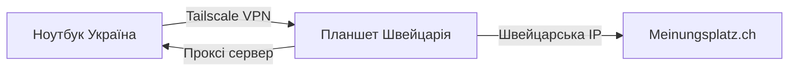

---
{"title":"Swiss Survey Automation System","dg-publish":true,"dg-metatags":null,"dg-home":null,"permalink":"/arsen/swiss-survey-automation-system/","dgPassFrontmatter":true,"noteIcon":""}
---


## Повна інструкція налаштування та використання

---

## 📋 Зміст

1. [Огляд системи](https://claude.ai/chat/98c4ec99-edb7-4388-91eb-cfa741f4b10f#%D0%BE%D0%B3%D0%BB%D1%8F%D0%B4-%D1%81%D0%B8%D1%81%D1%82%D0%B5%D0%BC%D0%B8)
2. [Підготовка планшета (Швейцарія)](https://claude.ai/chat/98c4ec99-edb7-4388-91eb-cfa741f4b10f#%D0%BF%D1%96%D0%B4%D0%B3%D0%BE%D1%82%D0%BE%D0%B2%D0%BA%D0%B0-%D0%BF%D0%BB%D0%B0%D0%BD%D1%88%D0%B5%D1%82%D0%B0)
3. [Налаштування Tailscale](https://claude.ai/chat/98c4ec99-edb7-4388-91eb-cfa741f4b10f#%D0%BD%D0%B0%D0%BB%D0%B0%D1%88%D1%82%D1%83%D0%B2%D0%B0%D0%BD%D0%BD%D1%8F-tailscale)
4. [Встановлення системи на планшеті](https://claude.ai/chat/98c4ec99-edb7-4388-91eb-cfa741f4b10f#%D0%B2%D1%81%D1%82%D0%B0%D0%BD%D0%BE%D0%B2%D0%BB%D0%B5%D0%BD%D0%BD%D1%8F-%D0%BD%D0%B0-%D0%BF%D0%BB%D0%B0%D0%BD%D1%88%D0%B5%D1%82%D1%96)
5. [Налаштування на ноутбуці (Україна)](https://claude.ai/chat/98c4ec99-edb7-4388-91eb-cfa741f4b10f#%D0%BD%D0%B0%D0%BB%D0%B0%D1%88%D1%82%D1%83%D0%B2%D0%B0%D0%BD%D0%BD%D1%8F-%D0%BD%D0%BE%D1%83%D1%82%D0%B1%D1%83%D0%BA%D0%B0)
6. [Використання системи](https://claude.ai/chat/98c4ec99-edb7-4388-91eb-cfa741f4b10f#%D0%B2%D0%B8%D0%BA%D0%BE%D1%80%D0%B8%D1%81%D1%82%D0%B0%D0%BD%D0%BD%D1%8F-%D1%81%D0%B8%D1%81%D1%82%D0%B5%D0%BC%D0%B8)
7. [Вирішення проблем](https://claude.ai/chat/98c4ec99-edb7-4388-91eb-cfa741f4b10f#%D0%B2%D0%B8%D1%80%D1%96%D1%88%D0%B5%D0%BD%D0%BD%D1%8F-%D0%BF%D1%80%D0%BE%D0%B1%D0%BB%D0%B5%D0%BC)

---

## 🎯 Огляд системи

### Що це?

Система дозволяє:

- ✅ Проходити опитування на meinungsplatz.ch через планшет у Швейцарії
- ✅ Обходити VPN-фільтри
- ✅ Автоматизувати прийняття опитувань
- ✅ Працювати віддалено з України

### Як працює?



### Необхідні компоненти

- 📱 **Планшет у Швейцарії** (Galaxy Tab з Android)
- 💻 **Ноутбук в Україні** (Windows)
- 🔗 **Tailscale** (безкоштовний VPN)
- 📦 **Termux** (термінал для Android)

---

## 📱 Підготовка планшета

### Крок 1: Встановлення Termux

**ВАЖЛИВО:** Встановлюйте Termux з **F-Droid**, НЕ з Google Play!

1. **Завантажте F-Droid:**
    
    ```
    https://f-droid.org/F-Droid.apk
    ```
    
2. **Встановіть F-Droid:**
    
    - Налаштування → Безпека → Дозволити встановлення з невідомих джерел
    - Відкрийте завантажений APK файл
    - Встановіть
3. **Встановіть Termux з F-Droid:**
    
    - Відкрийте F-Droid
    - Пошук: "Termux"
    - Встановити

### Крок 2: Перше налаштування Termux

Відкрийте Termux та виконайте:

```bash
# Оновлення пакетів
pkg update
pkg upgrade

# Дозвіл на доступ до сховища
termux-setup-storage

# Встановлення базових інструментів
pkg install nano wget curl
```

---

## 🔗 Налаштування Tailscale

### На планшеті (Швейцарія)

1. **Встановіть Tailscale в Termux:**
    
    ```bash
    pkg install tailscale
    ```
    
2. **Запустіть Tailscale:**
    
    ```bash
    # Запуск демона в фоні
    tailscaled &
    
    # Авторизація (використайте ваш акаунт)
    tailscale up
    ```
    
3. **Отримайте посилання для входу:**
    
    - Скопіюйте посилання
    - Відкрийте в браузері
    - Увійдіть в акаунт (той самий що на ноутбуці)
4. **Перевірте IP адресу:**
    
    ```bash
    tailscale ip -4
    ```
    
    Запишіть цю адресу! (наприклад: `100.90.70.54`)
    

### На ноутбуці (Україна)

1. **Завантажте Tailscale для Windows:**
    
    ```
    https://tailscale.com/download/windows
    ```
    
2. **Встановіть та увійдіть:**
    
    - Запустіть інсталятор
    - Увійдіть в той самий акаунт
    - Дочекайтесь підключення
3. **Перевірте з'єднання:**
    
    ```powershell
    ping 100.90.70.54
    ```
    
    Має показати відповідь від планшета
    

---

## 💾 Встановлення на планшеті

### Крок 1: Створення та збереження скрипта

#### Варіант А: Через nano (простіший)

1. **Створіть файл:**
    
    ```bash
    cd ~
    nano setup.sh
    ```
    
2. **Вставте скрипт:**
    
    - На ПК скопіюйте весь скрипт
    - В Termux: довгий тап → Paste
3. **Збережіть:**
    
    - `Ctrl + X`
    - `Y` (підтвердити)
    - `Enter`

#### Варіант Б: Через Telegram

1. **Відправте скрипт собі в Telegram**
    
2. **На планшеті збережіть файл:**
    
    - Завантажте з Telegram в папку Downloads
3. **В Termux скопіюйте файл:**
    
    ```bash
    # Перейдіть в домашню директорію
    cd ~
    
    # Скопіюйте з Downloads
    cp /storage/emulated/0/Download/setup.sh .
    
    # Або якщо не працює
    cp ~/storage/downloads/setup.sh .
    ```
    

### Крок 2: Запуск інсталяції

```bash
# Надайте права на виконання
chmod +x setup.sh

# Запустіть скрипт
./setup.sh
```

### Крок 3: Процес інсталяції

1. **З'явиться меню:**
    
    ```
    ╔════════════════════════════════════════╗
    ║   SWISS AUTOMATION SETUP v2.0         ║
    ║   Tailscale IP: 100.90.70.54         ║
    ╚════════════════════════════════════════╝
    
    Виберіть дію:
    1) Повна інсталяція
    2) Тільки проксі сервер
    3) Тільки автоматизація опитувань
    4) Запустити систему
    5) Статус системи
    6) Вийти
    ```
    
2. **Введіть `1` та натисніть Enter**
    
3. **Дочекайтесь завершення** (10-15 хвилин):
    
    - [1/5] Встановлення базових пакетів
    - [2/5] Створення проксі серверів
    - [3/5] Створення системи автоматизації
    - [4/5] Створення менеджера системи
    - [5/5] Налаштування Nginx

### Крок 4: Налаштування паролів

**ВАЖЛИВО:** Відредагуйте паролі акаунтів!

```bash
# Відкрийте файл автоматизації
nano ~/swiss-automation/survey_automation.py

# Знайдіть рядки:
ACCOUNTS = {
    "arsen.k111999@gmail.com": {
        "password": "YOUR_PASSWORD",  # <- змініть тут
    },
    "lekov00@gmail.com": {
        "password": "YOUR_PASSWORD",  # <- і тут
    }
}

# Збережіть: Ctrl+X, Y, Enter
```

### Крок 5: Запуск системи

```bash
# Запустіть всі сервіси
swiss start

# Або повна команда
~/swiss-automation/manager.sh start
```

Має показати:

```
🚀 Starting all services...
✓ Proxy started (ports 1080, 8888)
✓ Survey automation started (port 8080)
✓ Nginx started (port 80)

🌐 Access points:
  HTTP Proxy: http://100.90.70.54:8888
  SOCKS5: socks5://100.90.70.54:1080
  Survey API: http://100.90.70.54:8080
  Stats: http://100.90.70.54:8888/stats
```

---

## 💻 Налаштування ноутбука

### Варіант 1: Налаштування браузера Firefox

1. **Відкрийте налаштування:**
    
    - Меню → Налаштування
    - Прокрутіть до "Мережеві налаштування"
    - Натисніть "Налаштувати..."
2. **Виберіть "Ручна конфігурація проксі":**
    
    ```
    HTTP проксі: 100.90.70.54    Порт: 8888
    HTTPS проксі: 100.90.70.54   Порт: 8888
    SOCKS хост: 100.90.70.54     Порт: 1080
    SOCKS v5: ✓
    ```
    
3. **Збережіть та перевірте:**
    
    - Відкрийте https://whatismyipaddress.com
    - Має показати Швейцарію

### Варіант 2: Chrome з проксі

Створіть ярлик Chrome:

```batch
chrome.exe --proxy-server="socks5://100.90.70.54:1080" --user-data-dir="%TEMP%\chrome-swiss"
```

### Варіант 3: Системний проксі Windows

1. **Налаштування → Мережа та Інтернет → Проксі**
2. **Ручне налаштування проксі:**
    - Адреса: `100.90.70.54`
    - Порт: `8888`
    - Увімкнути

---

## 🚀 Використання системи

### Перевірка статусу

**На планшеті:**

```bash
# Статус всіх сервісів
swiss status

# Перегляд логів
swiss logs proxy   # логи проксі
swiss logs survey  # логи автоматизації
```

**З ноутбука (браузер):**

- Статистика проксі: http://100.90.70.54:8888/stats
- API статус: http://100.90.70.54:8080/health
- Перевірка IP: http://100.90.70.54:8080/check-ip

### Автоматичне прийняття опитувань

**Через N8N:**

```json
POST http://100.90.70.54:8080/accept-survey
{
  "email": "arsen.k111999@gmail.com",
  "surveyUrl": "https://meinungsplatz.ch/survey/...",
  "reward": "5.50"
}
```

### Зупинка системи

```bash
# На планшеті
swiss stop
```

---

## 🔧 Вирішення проблем

### Проблема: "command not found: swiss"

**Рішення:**

```bash
# Додайте alias вручну
echo "alias swiss='~/swiss-automation/manager.sh'" >> ~/.bashrc
source ~/.bashrc
```

### Проблема: Не працює проксі

**Перевірка:**

```bash
# На планшеті
netstat -tlnp | grep -E "1080|8888|8080"

# Перезапуск
swiss restart
```

### Проблема: "Not in Switzerland" помилка

**Перевірка IP на планшеті:**

```bash
curl https://ipapi.co/json/
```

**Має показати:**

```json
{
  "country": "CH",
  "country_name": "Switzerland"
}
```

Якщо ні - планшет використовує VPN або не в Швейцарії!

### Проблема: Termux закривається

**Рішення:**

1. Налаштування Android → Додатки → Termux
2. Акумулятор → Без обмежень
3. Вимкніть оптимізацію батареї

### Автозапуск при перезавантаженні

```bash
# Встановіть Termux:Boot з F-Droid
pkg install termux-services

# Створіть скрипт автозапуску
mkdir -p ~/.termux/boot
cat > ~/.termux/boot/start-swiss.sh << 'EOF'
#!/data/data/com.termux/files/usr/bin/bash
sleep 10
tailscaled &
sleep 5
~/swiss-automation/manager.sh start
EOF

chmod +x ~/.termux/boot/start-swiss.sh
```

---

## 📊 Моніторинг та статистика

### Dashboard в браузері

Створіть закладки:

- 📊 **Проксі статистика:** `http://100.90.70.54:8888/stats`
- 🔍 **IP перевірка:** `http://100.90.70.54:8080/check-ip`
- 💰 **Статистика опитувань:** `http://100.90.70.54:8080/stats`

### Telegram сповіщення

Додайте в N8N workflow сповіщення про:

- ✅ Успішно прийняті опитування
- ❌ Помилки
- 📊 Денну статистику

---

## 🔒 Безпека

### Важливі правила

1. **НІКОЛИ** не використовуйте VPN на планшеті
2. **ЗАВЖДИ** перевіряйте IP перед опитуваннями
3. **НЕ** відкривайте посилання опитувань напряму з України
4. Використовуйте **різні** паролі для акаунтів

### Резервне копіювання

```bash
# На планшеті
cd ~
tar -czf swiss-backup.tar.gz swiss-automation/
# Відправте файл собі
```

---

## 📞 Контакти для допомоги

- **Син (планшет):** Telegram @...
- **Технічна підтримка:** Цей чат

---

## ✅ Чек-лист запуску

- [ ] Termux встановлено з F-Droid
- [ ] Tailscale працює на обох пристроях
- [ ] Ping до планшета проходить
- [ ] Скрипт setup.sh запущено
- [ ] Паролі акаунтів налаштовано
- [ ] Система запущена (swiss start)
- [ ] Проксі в браузері налаштовано
- [ ] IP показує Швейцарію

---

**Успіхів! Все буде Україна! 🇺🇦**