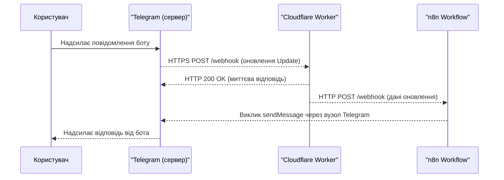

---
{"title":"Інтеграція OpenAPI Generator з n8n для бекенду Telegram ботів та MiniApps","dg-publish":true,"dg-metatags":null,"dg-home":null,"permalink":"/dokumentacziya-do-proektu-exodus-pp-ua/integracziya-open-api-generator-z-n8n-dlya-bekendu-telegram-botiv-ta-mini-apps/","dgPassFrontmatter":true,"noteIcon":""}
---


## OpenAPI Generator: можливості та призначення

OpenAPI Generator – це інструмент, що автоматично генерує програмний код клієнтів та серверів на основі специфікації OpenAPI (раніше Swagger). Він підтримує понад 50 генераторів клієнтів і може створювати серверні шаблони (stubs) для більш ніж 40 мов і технологій. Це означає, що маючи опис API в форматі OpenAPI (YAML/JSON), розробник може отримати каркас серверу або SDK-клієнти для різних мов. Такий підхід сприяє **API-first розробці** – спочатку визначається контракт API, а вже потім реалізується бізнес-логіка. Згенерований код виступає “каркасом”, до якого додається необхідна логіка, забезпечуючи відповідність реалізації специфікації API.

### Генерація серверного коду (JavaScript/Node.js для Cloudflare Workers)

OpenAPI Generator має генератори і для JavaScript/Node.js – наприклад, генератор **nodejs-express-server** створює REST API-сервер на Express.js. Це зручно для наших цілей, оскільки Cloudflare Workers підтримує JavaScript (на базі V8). Процес генерації зазвичай виглядає так: ви запускаєте CLI з вказанням шаблону (generator) та вхідної OpenAPI-специфікації, і отримуєте готовий проект. Наприклад, команда для генерації Node.js Express сервера може бути такою:

```bash
openapi-generator-cli generate -g nodejs-express-server \
    -i api-spec.yaml -o ./generated-server
```

Як результат, у папці `generated-server` буде повнофункціональний сервер Express, що реалізує задані в спецификації ендпоїнти. Для Cloudflare Workers стандартний Express-сервер потребує адаптації, адже Workers працюють у безсерверному середовищі з обмеженнями Node.js. Зокрема, Cloudflare Worker – це ізольований V8-виконавець, який **не підтримує** власний HTTP-сервер (`http`/`Express`), а використовує подію `fetch` і стандартний **Fetch API** для обробки запитів. Тому згенерований код на Express можна використовувати як основу: бізнес-логіку і маршрути – перенести в Worker-скрипт. Альтернатива – обрати інший генератор, наприклад, **typescript-fetch**, щоб згенерувати тільки клієнтські виклики (якщо сервер буде мінімалістичним) або створити шаблон під Cloudflare Worker самостійно. У будь-якому разі, OpenAPI Generator значно скорочує рутину, створюючи структуру проекту, моделі даних, роутери тощо згідно зі специфікацією API.

### Приклад конфігурації OpenAPI Generator для Cloudflare Workers

В контексті Cloudflare Workers, важливо врахувати деякі параметри генерації. Наприклад, можна використовувати файл конфігурації (JSON/YAML) для OpenAPI Generator, щоб налаштувати цільову середовище. Хоча прямого генератора “Cloudflare Worker” немає, генерація Node.js-коду з подальшими правками – поширений підхід. Ось кілька кроків конфігурації та найкращі практики:

- **Вибір генератора:** для бекенду на Node.js обираємо `nodejs-express-server` (JavaScript). У конфігурації можна вказати `serverPort=null`, оскільки в Cloudflare Worker порт не використовується.
- **Додаткові властивості:** якщо потрібно, через `additional-properties` можна вимкнути генерацію прикладів, тестів тощо, залишивши лише необхідний код. Також варто вимкнути API-документацію, якщо вона не потрібна на Worker.
- **Тип вихідного модуля:** Cloudflare Workers зараз підтримують модулі ES. Тому після генерації бажано конвертувати код у формат ES Module (або налаштувати транспіляцію), або використати bundler, щоб підготувати один скрипт Worker.
- **Валідація схем:** згенерований сервер може включати перевірку вхідних даних згідно схем OpenAPI. Це корисно, адже на рівні Workers це забезпечить відсів некоректних запитів ще до виконання основної логіки.

Конфігураційний файл для OpenAPI Generator міг би містити, наприклад, такі параметри (YAML-фрагмент):

```yaml
generatorName: nodejs-express-server
outputDir: generated-server
additionalProperties:
  projectName: telegram-bot-backend
  serverPort: 'null'
```

Це вказує генератору створити Express-серверний каркас для проекту “telegram-bot-backend” без прив’язки до конкретного порту. Після генерації розробник переносить цей код у Cloudflare Worker середовище, замінюючи запуск Express на обробник `event.request`. У підсумку, OpenAPI Generator дає нам швидкий старт у вигляді каркасу бекенду, який ми пристосовуємо під Workers.

## n8n та інтеграція з OpenAPI Generator

**n8n** – це платформа для побудови робочих потоків (workflow automation), яка дозволяє інтегрувати різні сервіси без написання коду, або з мінімальним кодом. В контексті Telegram ботів та MiniApps, n8n може відігравати роль “мозку” – обробляти події, виконувати бізнес-логіку, звертатися до сторонніх API та відправляти відповіді. Перевага n8n в тому, що вона має готові вузли для багатьох сервісів, зокрема існують вузли для **Telegram**. Telegram-вузол в n8n підтримує різні дії (надсилання повідомлень, отримання файлів, редагування повідомлень тощо), а також є **Telegram Trigger** для отримання оновлень від бота (через вебхук). Таким чином, n8n може прямо взаємодіяти з Telegram Bot API без необхідності вручну викликати HTTP-запити.

Інтеграція OpenAPI Generator з n8n може відбуватися на декількох рівнях:

- **Використання OpenAPI-специфікації в n8n:** якщо у вас є OpenAPI-опис будь-якого API, ви можете прискорити інтеграцію цього API в n8n. Існує інструмент `@devlikeapro/n8n-openapi-node`, що дозволяє згенерувати кастомний вузол n8n з OpenAPI-специфікації буквально за кілька хвилин. Це означає, що для власного бекенду (задокументованого через OpenAPI) можна автоматично створити нативний інтеграційний вузол в n8n. В якості прикладу автори наводять згенерований вузол для Petstore API за OpenAPI v3. У нашому випадку, маючи специфікацію бекенду бота (або зовнішніх сервісів, з якими бот працює), ми можемо швидко імпортувати їх у n8n як модулі, не прописуючи вручну всі поля запитів/відповідей.
    
- **Взаємодія зі згенерованим серверним кодом:** згенерований OpenAPI Generator сервер (наприклад, Cloudflare Worker API) може співпрацювати з n8n шляхом обміну HTTP-запитами. Один зі сценаріїв – **передача запитів від Worker до n8n**: коли Worker отримує виклик на певний ендпоїнт, він переадресовує (проксіює) цей запит до відповідного workflow в n8n. Це можна зробити через вузол **Webhook** в n8n: створюється Workflow з тригером Webhook, і Worker робить HTTP POST на URL цього вебхука, передаючи дані. Далі n8n вже виконує необхідні кроки: наприклад, звертається до бази даних, до API Telegram або інших сервісів, і формує відповідь. Альтернативний сценарій – **виклики від n8n до згенерованого API**: тут Worker API виступає як автономний сервіс, а n8n звертається до нього (наприклад, для отримання даних). В n8n можна використовувати вузол HTTP Request або згенерований кастомний вузол (як описано вище) для виклику методів API, визначених OpenAPI-специфікацією.
    
- **Переваги підходу:** поєднання OpenAPI та n8n дає змогу розробляти масштабовані рішення швидше і з меншою кількістю помилок. OpenAPI забезпечує чіткий контракт і документацію для API, що спрощує підтримку та розвиток (можна ітеративно змінювати API і генерувати оновлений код без переписування вручну великого обсягу коду). n8n, у свою чергу, знімає багато рутини інтеграції – ви отримуєте готові блоки для роботи з Telegram та іншими сервісами, можливість візуально будувати потоки. За рахунок цього легше масштабувати рішення: можна розподілити навантаження – Cloudflare Workers обробляє HTTP-рівень (на крайових датацентрах по всьому світу), а n8n-вузли виконують більш важку або довготривалу логіку (можливо, на окремому сервері або у хмарі). Також це додає гнучкості – змінити бізнес-логіку можна, оновивши workflow в n8n без необхідності заново деплоїти код Worker’а (якщо контракт API лишається тим самим). Крім того, n8n дозволяє легко інтегрувати додаткові сервіси: наприклад, бот може через n8n записувати дані в Google Sheets, відправляти повідомлення на email або викликати сторонні API – все це є готовим функціоналом n8n.
    

Отже, інтеграція OpenAPI Generator і n8n створює зв’язку: **OpenAPI (дизайн та каркас API) + Cloudflare Worker (хостинг API) + n8n (workflow-логіка)**. Далі розглянемо практичні приклади такої архітектури для Telegram бота і для Telegram MiniApp.

## Практична реалізація бекенду для Telegram бота

Розробимо простий бекенд для Telegram-бота, використовуючи OpenAPI Generator та n8n. Припустимо, бот має реагувати на повідомлення користувача і виконувати якусь дію (наприклад, надсилати у відповідь інформацію). Основні кроки: створення OpenAPI-специфікації для вебхука, генерація коду сервера, налаштування n8n для обробки оновлень і зв’язок зі службою Telegram.

### OpenAPI-специфікація для взаємодії з Telegram Bot API

Telegram Bot API – це HTTP API, за допомогою якого Telegram передає вашому боту повідомлення (оновлення) та через яке бот може відправляти відповіді. Спочатку опишемо **вхідний ендпоїнт** – вебхук, який Telegram буде викликати при отриманні нового повідомлення. В OpenAPI 3.0 це можна оформити так:

- **PATH**: `/webhook/telegram` (наприклад) з методом `POST`.
- **Request Body**: JSON, схема якого відповідає структурі об’єкта Update з Telegram Bot API.
- **Responses**: Telegram очікує від вашого вебхука просту відповідь 200 OK (тіло може бути порожнім). За бажанням, можна описати 200-відповідь без тіла.

Об’єкт **Update** містить багато полів (відповідно до офіційної документації Telegram). Можна скористатися готовою специфікацією: існує проект, який містить актуальну OpenAPI 3.1 специфікацію для Telegram Bot API. Він описує всі методи і типи Telegram, зокрема тип Update, Message тощо. Ми можемо імпортувати звідти визначення схем або вручну додати спрощену версію (наприклад, для нас важливі тільки `update_id`, `message.text`, `message.chat.id` тощо). Наша OpenAPI-специфікація для бота буде мінімальною – фактично один ендпоїнт вебхука. Приклад (фрагмент YAML):

```yaml
paths:
  /webhook/telegram:
    post:
      summary: Webhook для оновлень Telegram
      requestBody:
        required: true
        content:
          application/json:
            schema:
              $ref: '#/components/schemas/Update'
      responses:
        '200':
          description: OK (без тіла)
components:
  schemas:
    Update:
      type: object
      properties:
        update_id:
          type: integer
        message:
          type: object
          properties:
            message_id: { type: integer }
            text: { type: string }
            chat:
              type: object
              properties:
                id: { type: integer }
                type: { type: string }
      required: [update_id]
```

Це спрощена схема, але достатня, щоб отримати `chat.id` (кому відповідати) і `text` повідомлення. Спираючись на цю специфікацію, **генеруємо серверний код** (як описано раніше, за допомогою OpenAPI Generator). Отриманий сервер (припустимо, Express-додаток) міститиме маршрут `/webhook/telegram`, який приймає `Update` в JSON. Наша задача – впровадити в нього обробку: при надходженні оновлення викликати workflow в n8n.

### Генерація серверного коду і розгортання на Cloudflare Workers

Виконуємо генерацію (наприклад, командою CLI, як наведено вище). Далі потрібно інтегрувати цей код в Cloudflare Worker. У Cloudflare Workers немає прямого серверу, натомість є глобальний обробник запитів. Замість `app.listen()` ми використовуємо `addEventListener('fetch', ...)`. У найпростішому випадку, реалізація вебхука на Worker може виглядати так (псевдокод JavaScript):

```js
addEventListener('fetch', event => {
  event.respondWith(handleRequest(event.request));
});

async function handleRequest(request) {
  if (request.method === 'POST' && new URL(request.url).pathname === '/webhook/telegram') {
    const update = await request.json();
    // Переслати оновлення до n8n для обробки
    await fetch(N8N_WEBHOOK_URL, {
      method: 'POST',
      headers: { 'Content-Type': 'application/json' },
      body: JSON.stringify(update)
    });
    // Відповісти Telegram успішно, не чекаючи результатів обробки
    return new Response('OK', { status: 200 });
  }
  return new Response('Not found', { status: 404 });
}
```

Тут `N8N_WEBHOOK_URL` – URL вебхука, згенерованого n8n (при створенні вузла Webhook n8n надає унікальний шлях, наприклад `https://n8n.instance/webhook/******`). Ми читаємо JSON оновлення і **асинхронно (через `fetch`) відправляємо його в n8n**, одразу повертаючи Telegram’у статус 200. Telegram Bot API дозволяє відповідати на webhook-запит одразу, паралельно викликаючи метод Bot API. У нашому випадку ми відповідаємо 200 OK безпосередньо, а вся подальша логіка йде в n8n. Бажано використати `event.waitUntil()` для асинхронного виклику n8n, щоб Worker не завершився раніше часу. Також, для безпеки, Telegram підтримує **secret_token**: при встановленні вебхука ботом можна задати секрет, і Telegram буде відправляти його в заголовку `X-Telegram-Bot-Api-Secret-Token`. На боці Worker можна перевіряти цей заголовок, щоб переконатися, що запит справді від Telegram.

**Налаштування n8n для обробки бот-запитів:** Створимо у n8n новий workflow. Першим вузлом буде **Webhook** (Production URL якраз буде використовуватися Worker’ом). Після отримання оновлення, можна додати функцію або вузол **Set**, щоб витягти необхідні дані: наприклад, текст повідомлення та chat_id. Далі, використовуємо вузол **Telegram** (типу _Send Message_) – він вимагає прив’язати облікові дані бота (токен) один раз у налаштуваннях. Вузол Telegram заповнюємо: Chat ID – значення `update.message.chat.id` з попереднього кроку, Текст – бажану відповідь. За допомогою цього вузла n8n відправить повідомлення через Telegram Bot API. Власне, n8n вже під капотом робить HTTP запит до `sendMessage` методу Telegram. Оскільки n8n має вбудовану підтримку Telegram, він знає, які поля потрібні і як називаються методи (відповідність методам Bot API).

**Приклад:** якщо бот повинен просто підтверджувати отримане повідомлення, workflow може складатися з:

1. **Webhook** – отримує JSON оновлення.
2. **Function (JavaScript)** – парсить `item` (оновлення) і формує текст, наприклад: `const chatId = item.json.message.chat.id; const incomingText = item.json.message.text; return { chatId, replyText: "You said: " + incomingText };`.
3. **Telegram node (Send Message)** – бере `chatId` та `replyText` з попереднього кроку і відправляє повідомлення в Telegram.

**Мережева діаграма** нижче ілюструє увесь процес обробки повідомлення користувача:



_Пояснення:_ Користувач пише боту – Telegram пересилає оновлення на Cloudflare Worker (наш бекенд, згенерований OpenAPI Generator і розгорнутий на Workers). Worker швидко відповідає ОК і паралельно шле дані в n8n. n8n обробляє логіку та через Telegram API відправляє повідомлення користувачу. Весь цикл займає частки секунди, а завдяки Workers відповідь OK Telegram отримує дуже швидко (що запобігає повторним спробам).

### Фрагмент коду на JavaScript

Вище ми вже навели приклад коду Cloudflare Worker. Звернемо увагу на кілька моментів реалізації:

- **Forwarding до n8n:** використовується `fetch` до URL вебхука n8n. Цей URL можна взяти з інтерфейсу n8n (коли налаштовуєте Webhook node, там відображається унікальний endpoint). Важливо передавати заголовки Content-Type і сам JSON. У згенерованому коді Express-сервера ви могли б замість власної реалізації просто викликати функцію, що звертається до n8n. Наприклад, у контроллері, який генерується OpenAPI Generator, можна вставити щось на кшталт: `axios.post(process.env.N8N_URL, req.body)`.
- **Асинхронність:** Cloudflare Workers дозволяють виконувати додаткові завдання після відправки відповіді за допомогою `event.waitUntil()`. Наш код повертає Response('OK') одразу, але щоб `fetch` до n8n не було обірвано, можна написати: `event.waitUntil(fetch(N8N_URL, {...})); return new Response('OK');`.
- **Обмеження часу:** Telegram очікує відповідь webhook в межах кількох секунд. Наш підхід гарантовано цьому відповідає, оскільки відповідь не залежить від повної обробки логіки. Це **краща практика** – не виконувати довгу логіку в самому вебхуці Telegram, а делегувати її в бекграунд (через n8n чи черги).
- **Відправка відповіді через n8n:** У нашому випадку n8n сам звертається до Telegram API для відповіді. Можна було б також повернути щось із Worker, що Telegram використає як відповідь. Telegram Bot API підтримує пряму відповідь на webhook: наприклад, якщо в тілі HTTP 200 відповіді ви надішлете JSON з методом `sendMessage`, Telegram його виконає. Але реалізувати це дещо складніше (потрібно сформувати правильний JSON з методом та параметрами). Тому ми використовуємо простіший шлях – окремий виклик SendMessage з n8n.

Таким чином, бекенд бота працює: OpenAPI Generator дав нам швидкий старт для серверної частини (ми здебільшого додали тільки функцію переадресації в n8n), а n8n забезпечив гнучку обробку та інтеграцію з Telegram.

## Практична реалізація бекенду для Telegram MiniApps

**Telegram MiniApps** (Web Apps) – це міні-додатки, що запускаються всередині Telegram через ботів. Вони дозволяють створювати насичені інтерфейси (HTML/JS) прямо в чаті з ботом. По суті, MiniApp – це вебзастосунок, який може отримувати контекст від Telegram і взаємодіяти з ботом. Ключова особливість: MiniApp може **відправляти дані боту безпосередньо через Telegram, без власного HTTP-з’єднання**, використовуючи `Telegram.WebApp.sendData` у JS SDK. Це означає, що коли користувач натискає кнопку в інтерфейсі MiniApp, додаток може передати рядок даних боту, і Telegram надішле це як оновлення (service message) на той самий вебхук бота. Бот може відреагувати (наприклад, надіслати повідомлення чи виконати дію), не потребуючи окремого API-запиту від вебдодатка до сервера. Однак, MiniApps зазвичай також потребують бекенду: принаймні для **роздачі самого веб-додатка** (HTML/JS/CSS), а часто – й для додаткових API-викликів (наприклад, отримати дані для відображення списків, виконати оплату, зберегти результат тощо). Нижче розглянемо реалізацію, яка об’єднує обидва сценарії: і пряме спілкування через sendData, і виклики до бекенд API.

### Специфікація API для MiniApps і генерація коду

Розширимо нашу OpenAPI-специфікацію. Окрім шляху `/webhook/telegram`, додамо, наприклад, **ендпоїнт для самого вебзастосунку**. Припустимо, MiniApp – це бот для замовлення товарів (умовний приклад). Тоді нам потрібно, скажімо:

- `GET /miniapp` – віддавати початкову HTML сторінку або JSON з налаштуваннями. (Хоча HTML можна розмістити і на Cloudflare Pages чи в Worker KV, але розглянемо варіант через Workers.)
- `GET /api/products` – отримати список товарів (використовується MiniApp при завантаженні для відображення).
- `POST /api/order` – оформити замовлення (викликається з MiniApp при підтвердженні).

Ці ендпоїнти ми опишемо в OpenAPI з відповідними схемами даних (наприклад, схема Product, OrderRequest, OrderResponse). Генеруємо код сервера, який тепер матиме маршрути `/miniapp`, `/api/products`, `/api/order` і `/webhook/telegram`. Тут може виникнути питання: як віддавати HTML через OpenAPI-сервер? Можна визначити `/miniapp` як ендпоїнт, що повертає `text/html` (і згенерований код дозволить вручну вставити HTML-відповідь). Або зробити редирект з `/miniapp` на статичний хостинг. Зосередимося на API: `/api/products` (GET) і `/api/order` (POST JSON).

Після генерації коду адаптуємо його під Cloudflare Worker аналогічно, як з ботом. На Cloudflare Workers можна використовувати і KV для зберігання статики, і безпосередньо в коді верстати HTML. Припустимо, ми вирішили, що Worker повертає HTML із встроєним JS. У JS MiniApp використовується офіційна бібліотека Telegram Web Apps. При відкритті MiniApp Telegram передає в параметрах URL спеціальний рядок `initData`, який містить ідентифікатор користувача, його ім’я та інше, підписані HMAC. Цей рядок MiniApp може отримати через `window.Telegram.WebApp.initData` і передати при необхідності на свій бекенд.

**Перевірка initData:** Вкрай важливо верифікувати цей підписаний пакет на бекенді, щоб упевнитися, що його дійсно згенерував Telegram (а не зловмисник видає себе за користувача). Telegram надає алгоритм: потрібно виконати двоетапний HMAC-SHA256 з використанням токена бота як ключа і порівняти з полем `hash`. Якщо підписи співпали – дані (user ID, тощо) достовірні. У нашому бекенді можна створити утиліту для цього, або використати готову бібліотеку (наприклад, `@telegram-apps/init-data-node`). Ми можемо додати в OpenAPI-опис вимогу, що всі запити від клієнта мають містити заголовок Authorization із цими даними (наприклад, `Authorization: tma <initData>` як радять у прикладі). Це можна відобразити через securitySchemes в OpenAPI, але простіше перевіряти вручну в коді Worker перед обробкою запиту.

**Інтеграція з n8n (логіка MiniApp):** Розглянемо два потоки взаємодії:

1. **Запити безпосередньо до бекенду.** Коли MiniApp потребує дані (список товарів, деталі тощо), вона робить запит з браузера до наших API ендпоїнтів. Cloudflare Worker отримує цей запит, може його самостійно обробити, але якщо потрібна складна логіка – знов-таки пересилає в n8n. Наприклад, запит `GET /api/products` можна обробити через n8n: Worker робить `fetch` до Webhook URL, або навіть до спеціального **Webhook-ідентифікатора для конкретної події** (в n8n можна зробити окремий workflow "Отримати товари"). Цей workflow міг би з’єднатися з базою даних або Google Sheets, отримати список товарів і повернути через вузол **Respond to Webhook** дані у вигляді JSON. n8n підтримує вузол “Respond to Webhook”, який дозволяє надіслати відповідь HTTP назад на викликаючу сторону. Тобто, Worker викликав n8n і чекає на відповідь, а n8n після виконання кроків віддасть JSON, який Worker пробросить назад клієнту. Таким чином MiniApp отримує потрібні дані. Аналогічно з `POST /api/order`: можна налаштувати workflow, що приймає замовлення, зберігає його (скажімо, в Airtable або БД) і відповідає успіх/помилка.
    
2. **Взаємодія через sendData (Telegram).** В MiniApp, наприклад, після оформлення замовлення ми можемо не викликати `/api/order`, а просто викликати `Telegram.WebApp.sendData("order_created:123")`. Тоді Telegram відправить нашому боту сервісне повідомлення з цим рядком як повідомлення від користувача (точніше, як поле `message.web_app_data` в оновленні). Це оновлення прийде на **той самий вебхук** `/webhook/telegram`. Тому наш бекенд бота, реалізований раніше, вже вміє такі речі приймати (потрібно лише передбачити, що якщо `update.message.web_app_data` існує – це дані з MiniApp). Надалі все відбувається як зі звичайним повідомленням: Worker пересилає дані в n8n, workflow обробляє (наприклад, знаходить замовлення #123, відмічає його як оплачений) і може відповісти через Telegram. Відповідь може бути як звичайне повідомлення в чат (наприклад, “✅ Замовлення #123 прийнято”), або ж бот може використати методи Web App API: наприклад, **answerWebAppQuery** – щоб надіслати результат прямо у інтерфейс MiniApp (цей метод дозволяє передати дані назад у веб-додаток, якщо MiniApp була відкрита через inlineQuery). Для простоти, можна обмежитися надсиланням повідомлення в чат.
    

Нам потрібно обробити обидва типи взаємодії. Це означає, що **специфікація /webhook/telegram** має містити і можливі поля web_app_data. У Telegram `web_app_data.data` містить рядок, який MiniApp передала, а `web_app_data.button_text` – текст кнопки, з якої відкрили застосунок. Ми можемо розширити схему Update, додавши необов’язкове поле `message.web_app_data` типу object з полем data (string). Тоді згенерований код теж це врахує.

### Логіка MiniApp в n8n

Організуємо workflows:

- **Workflow “Init data verify & list products”:** тригер Webhook (на `/api/products` через спеціальний шлях) приймає запит з заголовком Authorization. Першим кроком можна вставити функцію, яка виконає валідацію `initData` підпису (з використанням відомого токена бота). Якщо не пройшло – кинути помилку (в n8n можна генерувати помилку, яка призведе до відповіді 401). Якщо все добре – другий крок (наприклад, функція або запит до БД) отримує список товарів. Третій крок – **Respond to Webhook** відправляє список товарів назад. Worker одержує цю відповідь і транслює її клієнту. Таким чином, дані потрапляють у MiniApp.
- **Workflow “Process order via webhook data”:** тригер Webhook (на який Worker шле всі Telegram оновлення) вже існує (ми створили для бота). Ми просто доповнимо його: якщо `msg = update.message`, і `msg.web_app_data` присутній, то виконуємо кроки для обробки замовлення. Наприклад, можна розпарсити `msg.web_app_data.data`, витягти ID замовлення, оновити статус замовлення в БД (іншим вузлом), і через Telegram-вузол відправити повідомлення підтвердження. Можна навіть зробити умовне розгалуження в n8n: якщо data починається з `"order_created"` – йдемо одним шляхом, якщо це звичайний текст – іншим (відповідно, різні сценарії для MiniApp і для простої команди бота).

### Діаграми та приклади коду

Розглянемо послідовність дій при використанні MiniApp, яка комбінує обидва способи зв’язку:

```mermaid
sequenceDiagram
    participant Користувач
    participant TelegramCli as "Telegram (клієнт)"
    participant Telegram as "Telegram (сервер)"
    participant Воркер as "Cloudflare Worker"
    participant n8n as "n8n"
    %% Launching the MiniApp
    Користувач->>TelegramCli: Відкриває MiniApp через бот
    TelegramCli-->>Воркер: HTTP GET /miniapp (з initData)
    Воркер-->>TelegramCli: Видає HTML/JS MiniApp (вбудовує initData)
    %% MiniApp requests data
    TelegramCli->>Воркер: AJAX GET /api/products (з header Authorization: tma <initData>)
    Воркер-->>n8n: HTTP POST /webhook_products (ініціація workflow для списку)
    n8n-->>Воркер: Повертає JSON зі списком товарів20
    Воркер-->>TelegramCli: Повертає JSON (список товарів) клієнту
    TelegramCli: Відображає список користувачу
    %% User places an order in MiniApp
    Користувач->>TelegramCli: Натискає "Замовити"
    TelegramCli->>Telegram: WebApp.sendData("order_created:123")
    Telegram-->>Воркер: HTTPS POST /webhook/telegram (містить web_app_data)
    Воркер-->>Telegram: HTTP 200 OK
    Воркер-->>n8n: HTTP POST /webhook (оновлення з даними замовлення)
    n8n-->>Telegram: Викликає sendMessage (підтвердження замовлення)
    Telegram-->>Користувач: Повідомлення від бота (наприклад, "Замовлення підтверджено")
```

На діаграмі видно, що MiniApp спочатку завантажується з сервера, потім запитує дані через API (ми це обробили через n8n), а фінальну дію відправляє через Telegram. Наш бекенд підтримує обидва канали. В реальному застосуванні MiniApp може також безпосередньо викликати бекенд через HTTP для деяких операцій – це нормально. Головне – забезпечити безпеку (верифікація initData) і оптимальність (що виконано локально, а що на сервері).

**Приклад коду для перевірки initData (Node.js):**

```js
const crypto = require('crypto');
function checkInitData(initData, botToken) {
    const params = new URLSearchParams(initData);
    const hash = params.get('hash');
    params.delete('hash');
    // 1. Сортуємо параметри
    const dataCheckString = [...params].map(e => e.join('=')).sort().join('\n');
    // 2. Генеруємо secret ключ
    const secretKey = crypto.createHmac('sha256', 'WebAppData').update(botToken).digest();
    // 3. Обчислюємо SHA256 по строкі даних з secretKey
    const calculatedHash = crypto.createHmac('sha256', secretKey).update(dataCheckString).digest('hex');
    return calculatedHash === hash;
}
```

Ця функція реалізує алгоритм з документації Telegram: спочатку формує рядок із параметрів, потім двічі застосовує HMAC. В workflow n8n можна викликати такий код (через Function node) для авторизації запиту. Якщо функція повернула false – припиняти виконання (наприклад, через помилку або умовний вузол).

**Обробка sendData в n8n:** в webhook-воркфлоу перевірка простіша – ми довіряємо, що це прийшло від Telegram (бо використали секретний токен на вебхуку). Отримавши `update.message.web_app_data.data = "order_created:123"`, можна розбити цю стрічку і використати `123` (ID замовлення) для подальших дій (вилучити з бази замовлення, підтвердити тощо). Це все можна робити засобами n8n: є вузли для баз даних (MySQL, Postgres), Google Sheet, HTTP тощо. Нарешті, Telegram-вузол відправляє користувачу підтвердження.

У підсумку, бекенд MiniApp складається з тих самих компонентів: Cloudflare Worker (згенерований код + вручну додана статична сторінка та проксі логіка) і n8n (бізнес-логіка, інтеграції). Такий підхід дозволяє MiniApp бути досить “тонким” клієнтом: всю важку роботу – наприклад, отримання даних, перевірки, збереження – робить сервер за допомогою n8n. А завдяки OpenAPI Generator у нас гарантується, що реалізовані ендпоїнти відповідають очікуваному контракту (що важливо при розростанні API).

## Оптимізація та найкращі практики

При створенні бекенду на зв’язці OpenAPI Generator + n8n + Cloudflare Workers, слід врахувати декілька аспектів оптимізації, продуктивності та безпеки:

### Розгортання на Cloudflare Workers

**Cloudflare Workers** надає вигідну платформу для бекенду ботів і міні-додатків. Вони працюють на глобальній мережі Cloudflare і автоматично масштабуються до тисяч інстансів по всьому світу. Це означає, що незалежно від того, звідки користувач взаємодіє з ботом, запит обробиться найближчим до нього датацентром, з мінімальною затримкою. Workers мають практично **нульовий cold start** – запуск нового ізольованого контексту виконується за ~0 мс завдяки використанню V8 isolates замість контейнерів. Для нас це означає, що навіть якщо бот раптом отримає пік навантаження (безліч одночасних повідомлень), Cloudflare швидко забезпечить потрібну кількість ізольованих виконань без помітних затримок для користувачів.

**Використання безкоштовного тарифу:** Cloudflare Workers має безкоштовний план, який дуже підходить для ботів на старті. Він дозволяє **100 000 запитів на день** (це близько 3 млн на місяць) і до 1000 запитів на хвилину (burst). Зберігання статичних даних через Workers KV теж має щедрий безкоштовний ліміт – 1 GB і до 100k читань на день. Наш бот і MiniApp цілком можуть поміститися в ці ліміти. Якщо проект виросте, перехід на платний план обійдеться від $5/місяць за 10 млн запитів, що все одно значно дешевше традиційних серверних рішень. Таким чином, ми можемо **безкоштовно розгорнути** весь бекенд на Cloudflare (включно з серверною логікою, статикою MiniApp і кешем), оплачуючи хіба що хостинг n8n (якщо не хостимо n8n самостійно).

### Продуктивність і кешування

Для покращення продуктивності варто використати можливості кешування:

- **Cache API в Workers:** Якщо деякі відповіді нашого API рідко змінюються (наприклад, список продуктів для MiniApp, що оновлюється раз на день), ми можемо кешувати відповіді на рівні Cloudflare. Workers дозволяють класти вміст у глобальний CDN-кеш через `caches.default.put(request, response)`. Це зменшить кількість звернень до n8n/бази. Слід бути обережним і очищати кеш при оновленнях даних.
- **Workers KV для статики:** MiniApp HTML/JS/CSS файли можуть бути розміщені в Workers KV, який розподіляється глобально і кешується на edge. Тоді Worker код буде лише читати KV (швидка операція) і повертати файл. Це корисно для медіафайлів, шаблонів тощо.
- **HTTP keep-alive до n8n:** При частих зверненнях з Worker до n8n варто використати агент з keep-alive (якщо n8n розгорнутий окремо), щоб не встановлювати TCP з’єднання на кожен виклик. Але в контексті Workers це складно контролювати, тому альтернатива – об’єднувати кілька дій в один webhook виклик, якщо можливо, щоб зменшити кількість запитів.
- **Обмеження CPU на Worker:** За замовчуванням на безкоштовному тарифі один Worker виклик має ~10 мс CPU часу. Це небагато, тому важку логіку ми і винесли в n8n. Потрібно стежити, щоб в коді Worker не було довгих синхронних обчислень або великих циклів. Якщо необхідно більше – можна збільшити ліміт до 50 мс (це також можливо на безкоштовному плані, вручну встановивши у налаштуваннях Worker).

### Безпека API

Безпека охоплює декілька шарів:

- **Перевірка джерела вебхуків:** Використовуйте `secret_token` при реєстрації webhook у Telegram. Ми вказували це при `setWebhook`, тож Worker знає очікуваний токен і звіряє заголовок. Telegram гарантує, що ніхто, окрім нього (і вас), не знає токен, отже такий заголовок підтверджує легітимність запиту.
- **Валідація даних через OpenAPI-схеми:** Згенерований код часто містить валідацію тіла запиту згідно зі схемами. Не відключайте її без потреби. Якщо Telegram (або клієнт MiniApp) раптом надішле щось не за протоколом, сервер відкине це 400 помилкою, що краще ніж обробляти некоректні дані.
- **Перевірка initData:** Як ми показали, потрібно валідувати initData кожного запиту від MiniApp, бо фронтенд може бути скомпрометований або запит можуть послати поза Telegram. Тільки успішна перевірка дозволяє довіряти `user.id` та іншим параметрам.
- **Авторизація викликів MiniApp API:** Окрім перевірки initData, подумайте чи потрібна додаткова авторизація. Наприклад, якщо API MiniApp дозволяє змінювати дані, переконайтеся, що користувач має на це право (можливо, використовуючи ті ж дані initData про нього). В OpenAPI можна прописати вимогу авторизації (OAuth2, JWT), але в Telegram MiniApp контексті зазвичай достатньо перевіреного initData.
- **Обмеження доступу до n8n:** Ваш n8n webhook URL бажано тримати в секреті, адже якщо хтось сторонній дізнається його, то може надіслати фальшивий запит у workflow. Для критичних викликів можна налаштувати в n8n **Basic Auth** для вебхука (Webhook node дозволяє задати базову автентифікацію або токен). Тоді Worker має додати відповідний заголовок. Це унеможливить виклики webhook ззовні (без знання пароля).
- **Зберігання секретів:** Токен Telegram бота, URL n8n та інші чутливі дані не повинні бути прописані в коді відкрито. У Cloudflare Workers для цього використовують **Environment Secrets** (через `wrangler secret put`), які доступні як `env.VAR_NAME` всередині Worker. n8n також шифрує свої креденшіали (наприклад, токен бота в Telegram node зберігається безпечно).
- **Додатковий захист:** Cloudflare надає можливість налаштувати **WAF правила** або **Access** для Workers. Наприклад, можна зробити правило, яке блокує всі запити до `/webhook/telegram`, якщо вони не з IP Telegram. Але IP Telegram не статичні і їх чимало; більш гнучко – перевірка secret_token, що ми вже робимо. Для MiniApp API можна виставити правило, щоб вони приймалися тільки з реферером `https://t.me` (Telegram клієнти відкривають WebApp у веб-вью з власним доменом), але це необов’язково і може завадити, якщо Telegram змінить поведінку. Важливо також увімкнути HTTPS (випадки HTTP не розглядаємо, Cloudflare завжди забезпечує HTTPS).

### Використання безкоштовних можливостей Cloudflare

Ми вже згадували про **безкоштовний план Workers** і **KV**. До інших корисних фіч, які є безкоштовними, відносяться:

- **Cloudflare Durable Objects (DO):** Для ботів DO можуть бути цікавими, якщо потрібна синхронізація стану або черги (на безкоштовному тарифі DO оплачується як використання Workers, без додаткової абонплати). Наприклад, можна мати Durable Object, який серіалізує всі повідомлення в чергу, якщо порядок важливий. Але Bot API і так гарантує послідовність оновлень для кожного чату, тому це не обов’язково.
- **Cloudflare Cron Triggers:** Якщо бот потребує періодичних завдань (скажімо, надсилати щоденні зведення), можна використати крон-тригери Workers (безкоштовно до 1 крону за хвилину). Або зробити планувальник в n8n (там також є Cron node).
- **Захист від DDoS:** Cloudflare автоматично захищає Worker від більшості атак. Наприклад, якщо хтось буде генерувати тисячі фейкових запитів, Cloudflare може почати відповідати кодом 429 або пропускати трафік повз Worker (fail-open) при перевищенні лімітів. Це запобігає несподіваним рахункам або збоям. У випадку бота, більшість трафіку все одно йде від Telegram серверів, що контрольовано.

### Додаткові оптимізації

- **Стиснення відповіді:** Для API-відповідей, що передаються користувачу (наприклад, JSON для MiniApp), варто ввімкнути компресію (GZIP/ Brotli). Cloudflare автоматично може компресувати відповідь Worker, якщо встановити відповідний заголовок. Це зменшить час завантаження, особливо на мобільному інтернеті.
- **Робота з великими файлами:** Якщо бот пересилає файли, врахуйте ліміт 5 секунд виконання Worker. Краще напряму пересилати файли з хмарного сховища користувачу, не проганяючи через Worker (або використовувати стріми і respondWith у Worker). n8n теж має вузол Telegram для отримання файлів, але великі файли краще обробляти окремо (Telegram дає посилання на файл, який можна завантажити).
- **Логування та моніторинг:** Налагоджувати таку архітектуру допомагає логування: Cloudflare Workers має console.log (логи видно в хмарі), а n8n показує виконання workflow (і журнали помилок). Рекомендовано обробляти винятки в Worker (try/catch навколо основної логіки) та відправляти їх, наприклад, у Sentry або просто логувати, щоб помилки не залишились непоміченими.

## Висновки та рекомендації

**Інтегрований підхід** із використанням OpenAPI Generator, n8n та Cloudflare Workers демонструє значні переваги при розробці бекенду для Telegram ботів і MiniApps:

- 🛠 **Швидкість розробки:** Генерація коду за OpenAPI скорочує час на налаштування серверу і написання моделей/маршрутів. n8n дозволяє реалізувати складну логіку без написання коду або з мінімальним кодом, шляхом комбінування готових інтеграцій. Це особливо корисно для прототипування і MVP, коли потрібно швидко запустити бота/додаток.
- 📑 **Чітка документація і контракт:** Наявність OpenAPI-специфікації означає, що ваш API задокументований “наживо”. Будь-який розробник (чи то новий член команди, чи то сторонній інтегратор) може зрозуміти, як спілкуватися з бекендом бота, переглянувши OpenAPI (його можна навіть опублікувати, згенерувавши з нього красиву HTML-доку). Це зменшує неоднозначності і помилки інтеграції.
- 🌐 **Масштабованість і продуктивність:** Cloudflare Workers забезпечує автоматичне масштабування на рівні інфраструктури – вам не треба турбуватися про балансувальники, відмовостійкість серверів тощо. 0ms холодного старту і виконання на edge дають високу швидкодію для користувачів по всьому світу. Крім того, розділення на Worker та n8n дозволяє масштабувати їх незалежно: при великому потоці складних задач можна масштабувати n8n (горизонтально або обирати більш потужний хост), тоді як Workers впораються з потоком HTTP-запитів.
- 🔒 **Безпека та надійність:** Використання перевірених компонентів (Telegram API, Cloudflare, n8n) підвищує надійність. OpenAPI-схеми діють як додатковий рівень валідації вводу. Cloudflare додає шар безпеки від атак. А n8n дозволяє легко імплементувати додаткові перевірки (наприклад, додати двофакторну авторизацію за потреби, лімітування запитів користувача тощо, використовуючи свої вузли).
- 🤖 **Гнучкість інтеграцій:** n8n відкриває двері до багатьох сервісів – ваш бот/miniapp може еволюціонувати, додаючи нові фічі: надсилати повідомлення в Slack, записувати дані в CRM, реагувати на івенти з інших систем. Все це можна робити в рамках існуючого workflow або додаванням нових. Таким чином, бот стає частиною ширшої екосистеми автоматизації.

**Рекомендації:** Починаючи проект, варто ретельно продумати і описати OpenAPI-специфікацію – це фундамент. Використовуйте можливості OpenAPI 3.0/3.1 максимально: компоненти схем (щоб не дублювати визначення типів Telegram), приклади (для генерації документації), розширення (`x-...`) якщо треба додати спеціальні деталі. Потім згенеруйте код і перевірте його, розгорніть на Workers (не забудьте про тестування в середовищі, наближеному до продакшену, наприклад через `wrangler dev`). Паралельно будуйте workflows в n8n, перевіряйте їх із зразками даних (n8n дозволяє запускати тестові події на webhook вручну).

Коли вся система складена, протестуйте весь ланцюжок інтеграцій: від надсилання реального повідомлення боту до відповіді, від відкриття MiniApp до отримання даних. Зверніть увагу на час відповіді – за потреби оптимізуйте (кешування, спрощення логіки). Введіть логування помилок і нетипових ситуацій (наприклад, якщо n8n повернув помилку, Worker міг би переслати її на якийсь сервіс сповіщень або в консоль логів).

На завершення, декілька **додаткових ресурсів** для подальшого вивчення та вдосконалення:

- 📘 **Офіційна документація OpenAPI Generator:** детально описує всі опції генераторів, підтримувані мови, та містить приклади конфігурації. В розділі Generators можна знайти генератор для NodeJS Express та його параметри.
- 🔧 **Документація n8n та приклади для Telegram:** на сайті n8n є опис вузла Telegram і готові рецепти інтеграції. Рекомендується стаття “How to build an API with n8n” – там, зокрема, обговорюється підхід API-first і використання OpenAPI/Swagger для документування API, що співзвучно нашому підходу.
- 🤖 **Telegram Bot API та MiniApps документація:** офіційна дока Telegram Bot API містить опис усіх методів і типів (варто звірятися з нею при побудові своїх схем). Для MiniApps є окремий розділ на core.telegram.org з детальними технічними рекомендаціями та прикладами використання JS API. Там же описані всі події, методи WebApp (наприклад, відкриття інвойсів, роботи з QR-кодами тощо), які можуть розширити функціональність вашого MiniApp.
- ☁️ **Cloudflare Workers Docs:** офіційна документація Workers з розділами про [Limits](https://developers.cloudflare.com/workers/platform/limits/) (щоб знати обмеження і як їх змінити), [KV Storage](https://developers.cloudflare.com/workers/runtime-apis/kv/) та приклади реалізації API. Також корисна стаття Cloudflare про використання OpenAPI схем – хоч вона про генерацію клієнтів до API Cloudflare, але показує підхід генерації кодом OpenAPI Generator у реальному сценарії.
- 🛠 **Приклади проектів на GitHub:** для практичного розуміння можна ознайомитися з репозиторієм шаблону Telegram бота на Cloudflare Workers (TypeScript) – там реалізовані основні виклики Bot API, ідеї по структурі проекту. Також проект **chanfana/itty-router-openapi** може бути цікавим, якщо захочете генерувати OpenAPI схему із коду Worker (протилежний підхід).

Спираючись на ці матеріали, ви зможете поглибити знання та вдосконалити свою реалізацію. Успіхів у побудові масштабованих і надійних Telegram ботів та MiniApps!