---
{"title":"🇨🇭 Swiss Proxy System - Повне керівництво налаштування","dg-publish":true,"dg-metatags":null,"dg-home":null,"permalink":"/dokumentacziya-proektu/swiss-proxy-system-povne-kerivnicztvo-nalashtuvannya/","dgPassFrontmatter":true,"noteIcon":""}
---


## 📖 Передмова

Це керівництво описує створення системи для безпечного доступу до швейцарських онлайн-сервісів через проксі-сервер на Android планшеті, що фізично знаходиться у Швейцарії. Система дозволяє обходити географічні обмеження та VPN-фільтри.

### ⚡ Ключові можливості

- ✅ Доступ з реальної швейцарської IP-адреси
- ✅ Обхід VPN-детекторів
- ✅ Автоматизація рутинних операцій
- ✅ Безпечне з'єднання через Tailscale VPN
- ✅ Моніторинг та статистика

---

## 🎯 Архітектура системи

```mermaid
graph TB
    subgraph Ukraine[Україна]
        PC[Ноутбук Windows<br/>Firefox/Chrome]
        N8N[N8N Automation]
    end
    
    subgraph Switzerland[Швейцарія]
        Tablet[Android Планшет<br/>Galaxy Tab]
        Termux[Termux App]
        Proxy[Proxy Server<br/>:9999]
        API[API Server<br/>:8080]
        SOCKS[SOCKS5<br/>:1080]
    end
    
    subgraph Services[Швейцарські сервіси]
        MP[meinungsplatz.ch]
        Other[Інші сайти]
    end
    
    PC -->|Tailscale VPN<br/>100.90.70.54| Tablet
    N8N -->|HTTP API| API
    PC -->|HTTP/SOCKS5| Proxy
    Proxy -->|Swiss IP| MP
    API -->|Automation| MP
    SOCKS -->|Direct| Other
    
    style Tablet fill:#4CAF50
    style MP fill:#2196F3
    style PC fill:#FF9800
```



### 🔑 Ключові компоненти

|Компонент|Призначення|Порт|Протокол|
|---|---|---|---|
|**Tailscale VPN**|Безпечне з'єднання між пристроями|-|WireGuard|
|**HTTP Proxy**|Проксування веб-трафіку|9999|HTTP/HTTPS|
|**SOCKS5 Proxy**|Універсальне проксування|1080|SOCKS5|
|**API Server**|Автоматизація операцій|8080|REST API|
|**Termux**|Linux-середовище на Android|-|-|

---

## 📱 Частина 1: Налаштування планшета (Швейцарія)

### 1.1 Встановлення базового ПЗ

#### Крок 1: Встановлення F-Droid

```bash
# Завантажте F-Droid (НЕ з Google Play!)
https://f-droid.org/F-Droid.apk

# Дозволи
Налаштування → Безпека → Невідомі джерела → Дозволити
```

#### Крок 2: Встановлення Termux

```bash
F-Droid → Пошук → Termux → Встановити
```

> ⚠️ **ВАЖЛИВО**: Termux з Google Play не працює коректно!

#### Крок 3: Встановлення Tailscale

```bash
# Встановіть Tailscale з Google Play
# АБО завантажте APK:
https://pkgs.tailscale.com/stable/tailscale.apk
```

### 1.2 Налаштування Tailscale

1. **Запустіть Tailscale додаток**
2. **Sign in** → використайте Google/Microsoft акаунт
3. **Дозволи** → надайте VPN дозволи
4. **Отримайте IP** → запишіть (формат: 100.x.x.x)

#### Налаштування енергозбереження

```
Налаштування Android → Додатки → Tailscale
├── Акумулятор → Без обмежень
├── Дозволи → Всі дозволені
└── Автозапуск → Увімкнено
```

### 1.3 Базове налаштування Termux

```bash
# Оновлення системи
pkg update && pkg upgrade -y

# Надання доступу до сховища
termux-setup-storage

# Встановлення базових пакетів
pkg install -y python nodejs git wget curl nano
pkg install -y openssh screen tmux net-tools

# Python пакети
pip install --upgrade pip
pip install flask requests aiohttp asyncio
```

---

## 💻 Частина 2: Встановлення проксі-системи

### 2.1 Створення робочої директорії

```bash
# Створіть директорію
mkdir -p ~/swiss-automation
cd ~/swiss-automation
```

### 2.2 Створення проксі-сервера

Створіть файл `smart_proxy.py`:

```python
#!/usr/bin/env python3
"""
Smart Proxy Server для обходу VPN-детекції
Порти: 9999 (HTTP), 1080 (SOCKS5)
"""
import asyncio
import socket
import struct
import aiohttp
from aiohttp import web
import logging
import os

logging.basicConfig(level=logging.INFO)
logger = logging.getLogger(__name__)

class SwissProxy:
    def __init__(self):
        self.stats = {"requests": 0, "success": 0, "failed": 0}
        # Швейцарські заголовки для маскування
        self.swiss_headers = {
            'Accept-Language': 'de-CH,de;q=0.9,fr-CH;q=0.8',
            'Accept-Timezone': 'Europe/Zurich',
            'DNT': '1'
        }
        
    async def handle_http(self, request):
        """HTTP проксі з очищенням заголовків"""
        self.stats["requests"] += 1
        
        try:
            url = str(request.url)
            
            # Логування для meinungsplatz
            if 'meinungsplatz' in url:
                logger.info(f"🎯 Meinungsplatz request: {url}")
                
            # Копіюємо та модифікуємо заголовки
            headers = dict(request.headers)
            headers.update(self.swiss_headers)
            
            # ВАЖЛИВО: Видаляємо заголовки що видають проксі
            proxy_headers = [
                'X-Forwarded-For', 'X-Real-IP', 'X-Originating-IP',
                'X-Forwarded-Host', 'X-ProxyUser-Ip', 'Via',
                'Forwarded', 'True-Client-IP', 'X-Client-IP',
                'CF-Connecting-IP', 'X-Forwarded-Proto'
            ]
            for h in proxy_headers:
                headers.pop(h, None)
            
            # Швейцарський User-Agent
            headers['User-Agent'] = (
                'Mozilla/5.0 (Windows NT 10.0; Win64; x64) '
                'AppleWebKit/537.36 (KHTML, like Gecko) '
                'Chrome/120.0.0.0 Safari/537.36'
            )
            
            # Виконуємо запит
            async with aiohttp.ClientSession() as session:
                data = await request.read()
                
                async with session.request(
                    method=request.method,
                    url=url,
                    headers=headers,
                    data=data,
                    ssl=False,
                    allow_redirects=False
                ) as response:
                    body = await response.read()
                    self.stats["success"] += 1
                    
                    resp_headers = dict(response.headers)
                    resp_headers.pop('Content-Encoding', None)
                    
                    return web.Response(
                        body=body,
                        status=response.status,
                        headers=resp_headers
                    )
                    
        except Exception as e:
            logger.error(f"Proxy error: {e}")
            self.stats["failed"] += 1
            return web.Response(text=str(e), status=500)
    
    async def handle_socks5(self, reader, writer):
        """SOCKS5 проксі для універсального проксування"""
        try:
            # SOCKS5 handshake
            data = await reader.read(2)
            if not data or data[0] != 5:
                writer.close()
                return
                
            nmethods = data[1]
            await reader.read(nmethods)
            writer.write(b'\x05\x00')  # No auth required
            await writer.drain()
            
            # Connection request
            data = await reader.read(4)
            if data[1] != 1:  # Only support CONNECT
                writer.close()
                return
                
            # Parse destination address
            addr_type = data[3]
            if addr_type == 1:  # IPv4
                addr = socket.inet_ntoa(await reader.read(4))
            elif addr_type == 3:  # Domain name
                addr_len = (await reader.read(1))[0]
                addr = (await reader.read(addr_len)).decode()
            else:
                writer.close()
                return
                
            port = struct.unpack('!H', await reader.read(2))[0]
            
            logger.info(f"SOCKS5 connection to {addr}:{port}")
            
            # Connect to destination
            try:
                remote_reader, remote_writer = await asyncio.open_connection(addr, port)
                
                # Send success response
                writer.write(b'\x05\x00\x00\x01\x00\x00\x00\x00\x00\x00')
                await writer.drain()
                
                # Relay data between client and remote
                await asyncio.gather(
                    self.pipe(reader, remote_writer),
                    self.pipe(remote_reader, writer)
                )
                
            except Exception as e:
                logger.error(f"SOCKS5 connection failed: {e}")
                writer.write(b'\x05\x01\x00\x01\x00\x00\x00\x00\x00\x00')
                await writer.drain()
                
        finally:
            writer.close()
            
    async def pipe(self, reader, writer):
        """Relay data between connections"""
        try:
            while True:
                data = await reader.read(4096)
                if not data:
                    break
                writer.write(data)
                await writer.drain()
        except:
            pass
        finally:
            writer.close()
            
    async def start_servers(self):
        """Запуск HTTP та SOCKS5 серверів"""
        # HTTP сервер
        app = web.Application()
        app.router.add_route('*', '/{path:.*}', self.handle_http)
        
        # Stats endpoint
        async def stats_handler(request):
            return web.json_response(self.stats)
        app.router.add_get('/stats', stats_handler)
        
        runner = web.AppRunner(app)
        await runner.setup()
        http_site = web.TCPSite(runner, '0.0.0.0', 9999)
        
        # SOCKS5 сервер
        socks_server = await asyncio.start_server(
            self.handle_socks5, '0.0.0.0', 1080
        )
        
        await http_site.start()
        
        # Отримуємо IP з змінної середовища
        ip = os.environ.get('TAILSCALE_IP', 'localhost')
        
        print(f"✅ HTTP Proxy: http://{ip}:9999")
        print(f"✅ SOCKS5 Proxy: socks5://{ip}:1080")
        print(f"📊 Stats: http://{ip}:9999/stats")
        
        await socks_server.serve_forever()

if __name__ == "__main__":
    # Встановлюємо IP якщо є
    import subprocess
    try:
        result = subprocess.run(['ip', 'addr', 'show'], capture_output=True, text=True)
        for line in result.stdout.split('\n'):
            if 'inet 100.' in line:
                ip = line.split()[1].split('/')[0]
                os.environ['TAILSCALE_IP'] = ip
                break
    except:
        pass
    
    proxy = SwissProxy()
    asyncio.run(proxy.start_servers())
```

### 2.3 Створення API сервера

Створіть файл `survey_automation.py`:

```python
#!/usr/bin/env python3
"""
API Server для автоматизації та моніторингу
Порт: 8080
"""
from flask import Flask, request, jsonify
import requests
import json
import logging
from datetime import datetime

app = Flask(__name__)
logging.basicConfig(level=logging.INFO)

# Конфігурація акаунтів (ЗМІНІТЬ ПАРОЛІ!)
ACCOUNTS = {
    "arsen.k111999@gmail.com": {
        "password": "YOUR_PASSWORD_HERE"
    },
    "lekov00@gmail.com": {
        "password": "YOUR_PASSWORD_HERE"
    }
}

def check_swiss_ip():
    """Перевірка що ми в Швейцарії"""
    try:
        resp = requests.get('https://ipapi.co/json/', timeout=5)
        data = resp.json()
        country = data.get('country_code', '')
        city = data.get('city', '')
        
        is_swiss = country == 'CH'
        logging.info(f"IP Check: {city}, {country} - Swiss: {is_swiss}")
        
        return is_swiss, data
    except Exception as e:
        logging.error(f"IP check failed: {e}")
        return False, {}

@app.route('/health', methods=['GET'])
def health():
    """Health check endpoint"""
    return jsonify({
        "status": "healthy",
        "time": datetime.now().isoformat()
    })

@app.route('/check-ip', methods=['GET'])
def check_ip():
    """Перевірка IP адреси"""
    is_swiss, data = check_swiss_ip()
    return jsonify({
        "is_swiss": is_swiss,
        "ip": data.get('ip'),
        "country": data.get('country_name'),
        "city": data.get('city')
    })

@app.route('/accept-survey', methods=['POST'])
def accept_survey():
    """API для автоматичного прийняття опитувань"""
    data = request.json
    email = data.get('email')
    survey_url = data.get('surveyUrl')
    
    # Перевірка IP перед операцією
    is_swiss, ip_data = check_swiss_ip()
    if not is_swiss:
        return jsonify({
            "success": False,
            "error": "Not in Switzerland",
            "location": ip_data
        }), 403
    
    # Тут має бути код для Selenium/Playwright
    # для автоматичного прийняття опитування
    
    logging.info(f"Survey request for {email}: {survey_url}")
    
    return jsonify({
        "success": True,
        "message": f"Survey logged for {email}",
        "note": "Manual acceptance required for now"
    })

@app.route('/stats', methods=['GET'])
def stats():
    """Статистика системи"""
    return jsonify({
        "api_version": "1.0",
        "accounts": list(ACCOUNTS.keys()),
        "timestamp": datetime.now().isoformat()
    })

if __name__ == '__main__':
    import os
    ip = os.environ.get('TAILSCALE_IP', 'localhost')
    print(f"🚀 Survey Automation API")
    print(f"📍 Running on: http://{ip}:8080")
    app.run(host='0.0.0.0', port=8080, debug=False)
```

### 2.4 Створення менеджера системи

Створіть файл `manager.sh`:

```bash
#!/data/data/com.termux/files/usr/bin/bash

SETUP_DIR="/data/data/com.termux/files/home/swiss-automation"

# Автоматичне визначення Tailscale IP
TAILSCALE_IP=$(ip addr show | grep "inet 100\." | awk '{print $2}' | cut -d'/' -f1 | head -1)
if [ -z "$TAILSCALE_IP" ]; then
    TAILSCALE_IP="localhost"
fi

export TAILSCALE_IP

start_all() {
    echo "🚀 Starting all services..."
    
    # Запуск проксі сервера
    screen -dmS proxy python3 $SETUP_DIR/smart_proxy.py
    echo "✓ Proxy started (ports 1080, 9999)"
    
    # Запуск API сервера
    screen -dmS survey python3 $SETUP_DIR/survey_automation.py
    echo "✓ Survey API started (port 8080)"
    
    echo ""
    echo "📊 Services running:"
    screen -ls
    
    echo ""
    echo "🌐 Access points:"
    echo "  HTTP Proxy: http://$TAILSCALE_IP:9999"
    echo "  SOCKS5: socks5://$TAILSCALE_IP:1080"
    echo "  Survey API: http://$TAILSCALE_IP:8080"
    echo "  Stats: http://$TAILSCALE_IP:9999/stats"
}

stop_all() {
    echo "🛑 Stopping all services..."
    screen -X -S proxy quit 2>/dev/null
    screen -X -S survey quit 2>/dev/null
    pkill -f smart_proxy.py 2>/dev/null
    pkill -f survey_automation.py 2>/dev/null
    echo "✓ All services stopped"
}

restart() {
    stop_all
    sleep 2
    start_all
}

status() {
    echo "📊 System Status"
    echo "================"
    echo ""
    echo "Tailscale IP: $TAILSCALE_IP"
    echo ""
    echo "Active screens:"
    screen -ls
    echo ""
    echo "Python processes:"
    ps aux | grep python | grep -v grep
    echo ""
    echo "Listening ports:"
    netstat -tlnp 2>/dev/null | grep -E "9999|8080|1080" || echo "Cannot check ports (permission denied)"
    echo ""
    echo "Current IP location:"
    curl -s https://ipapi.co/json/ | python3 -m json.tool | grep -E "country|city|ip" | head -3
}

logs() {
    case $1 in
        proxy)
            echo "📜 Proxy logs (Ctrl+A then D to exit):"
            screen -r proxy
            ;;
        survey)
            echo "📜 Survey API logs (Ctrl+A then D to exit):"
            screen -r survey
            ;;
        *)
            echo "Usage: $0 logs {proxy|survey}"
            ;;
    esac
}

case "$1" in
    start) start_all ;;
    stop) stop_all ;;
    restart) restart ;;
    status) status ;;
    logs) logs $2 ;;
    *)
        echo "╔══════════════════════════════╗"
        echo "║  Swiss Automation Manager    ║"
        echo "╚══════════════════════════════╝"
        echo ""
        echo "Usage: $0 {start|stop|restart|status|logs}"
        echo ""
        echo "Commands:"
        echo "  start   - Start all services"
        echo "  stop    - Stop all services"
        echo "  restart - Restart all services"
        echo "  status  - Show system status"
        echo "  logs    - View logs (proxy/survey)"
        ;;
esac
```

### 2.5 Встановлення та налаштування

```bash
# Зробіть файли виконуваними
chmod +x smart_proxy.py
chmod +x survey_automation.py
chmod +x manager.sh

# Створіть alias для зручності
echo "alias swiss='~/swiss-automation/manager.sh'" >> ~/.bashrc
source ~/.bashrc

# ВАЖЛИВО: Налаштуйте паролі
nano survey_automation.py
# Знайдіть YOUR_PASSWORD_HERE та замініть на реальні паролі

# Запустіть систему
./manager.sh start
```

---

## 🖥️ Частина 3: Налаштування ноутбука (Україна)

### 3.1 Встановлення Tailscale

1. **Завантажте Tailscale для Windows**:
    
    ```
    https://tailscale.com/download/windows
    ```
    
2. **Встановіть та увійдіть**:
    
    - Використайте той самий акаунт що й на планшеті
    - Дочекайтесь підключення
3. **Перевірте з'єднання**:
    
    ```powershell
    ping 100.90.70.54  # IP вашого планшета
    ```
    

### 3.2 Налаштування Firefox

#### Метод 1: Через налаштування (рекомендовано)

1. **Відкрийте Firefox**
2. **Меню (☰)** → **Налаштування**
3. **Прокрутіть до "Параметри мережі"**
4. **"Налаштувати..."**

```
⦿ Ручне налаштування проксі-сервера

SOCKS хост: 100.90.70.54    Порт: 1080
⦿ SOCKS v5
☑ Проксі DNS при використанні SOCKS v5

Не використовувати проксі для: localhost, 127.0.0.1
```

#### Метод 2: Створення окремого профілю

```bash
# В адресному рядку Firefox
about:profiles

# Create New Profile → "Swiss"
# Налаштуйте проксі для цього профілю

# Створіть ярлик
Start-Process "C:\Program Files\Mozilla Firefox\firefox.exe" -ArgumentList "-P", "Swiss"
```

### 3.3 Налаштування Chrome

Створіть файл `chrome-swiss.bat`:

```batch
@echo off
set PROXY_IP=100.90.70.54
"C:\Program Files\Google\Chrome\Application\chrome.exe" ^
  --proxy-server="socks5://%PROXY_IP%:1080" ^
  --user-data-dir="%TEMP%\chrome-swiss" ^
  --no-first-run
```

### 3.4 Перевірка роботи

#### Тест 1: Перевірка IP

```powershell
# PowerShell
curl http://100.90.70.54:8080/check-ip

# Відповідь має бути:
{
  "is_swiss": true,
  "country": "Switzerland",
  "city": "Zurich"
}
```

#### Тест 2: Статистика проксі

```powershell
curl http://100.90.70.54:9999/stats

# Відповідь:
{
  "requests": 0,
  "success": 0,
  "failed": 0
}
```

#### Тест 3: Веб-перевірка

Відкрийте в браузері з проксі:

- https://whatismyipaddress.com → Має показати Швейцарію
- https://myip.com → Має показати швейцарського провайдера

---

## 🤖 Частина 4: Автоматизація з N8N

### 4.1 Налаштування N8N workflow

```json
{
  "nodes": [
    {
      "parameters": {
        "method": "GET",
        "url": "http://100.90.70.54:8080/check-ip",
        "options": {}
      },
      "name": "Check Swiss IP",
      "type": "n8n-nodes-base.httpRequest",
      "position": [250, 300]
    },
    {
      "parameters": {
        "conditions": {
          "conditions": [
            {
              "value1": "={{$json[\"is_swiss\"]}}",
              "value2": true
            }
          ]
        }
      },
      "name": "Is Swiss?",
      "type": "n8n-nodes-base.if",
      "position": [450, 300]
    },
    {
      "parameters": {
        "method": "POST",
        "url": "http://100.90.70.54:8080/accept-survey",
        "bodyParameters": {
          "parameters": [
            {
              "name": "email",
              "value": "={{$json[\"email\"]}}"
            },
            {
              "name": "surveyUrl",
              "value": "={{$json[\"surveyUrl\"]}}"
            }
          ]
        }
      },
      "name": "Accept Survey",
      "type": "n8n-nodes-base.httpRequest",
      "position": [650, 250]
    }
  ]
}
```

---

## 🔧 Частина 5: Обслуговування та усунення неполадок

### 5.1 Щоденне обслуговування

#### На планшеті

```bash
# Перевірка статусу
swiss status

# Перегляд логів
swiss logs proxy   # Ctrl+A, D для виходу
swiss logs survey  # Ctrl+A, D для виходу

# Перезапуск при проблемах
swiss restart
```

#### На ноутбуці

```powershell
# Перевірка з'єднання
ping 100.90.70.54

# Перевірка сервісів
curl http://100.90.70.54:9999/stats
curl http://100.90.70.54:8080/health
```

### 5.2 Типові проблеми та рішення

#### Проблема: "Connection refused"

```bash
# На планшеті
swiss restart

# Перевірте чи працює Tailscale
# В додатку Tailscale має бути "Connected"
```

#### Проблема: "Not in Switzerland"

```bash
# Перевірте IP на планшеті
curl https://ipapi.co/json/

# Має показати "country_code": "CH"
# Якщо ні - перевірте що немає VPN на планшеті
```

#### Проблема: Termux закривається

```
Android Налаштування → Додатки → Termux
├── Акумулятор → Без обмежень
├── Фонова активність → Дозволено
└── Автозапуск → Увімкнено
```

### 5.3 Автозапуск при перезавантаженні

```bash
# Встановіть Termux:Boot з F-Droid
pkg install termux-services

# Створіть скрипт автозапуску
mkdir -p ~/.termux/boot
cat > ~/.termux/boot/start-swiss.sh << 'EOF'
#!/data/data/com.termux/files/usr/bin/bash
termux-wake-lock
sleep 10
~/swiss-automation/manager.sh start
EOF

chmod +x ~/.termux/boot/start-swiss.sh
```

---

## 📊 Частина 6: Моніторинг та статистика

### 6.1 Dashboard URLs

Створіть закладки в браузері:

|Назва|URL|Призначення|
|---|---|---|
|📊 Proxy Stats|`http://100.90.70.54:9999/stats`|Статистика проксі|
|🔍 Check IP|`http://100.90.70.54:8080/check-ip`|Перевірка IP|
|❤️ Health|`http://100.90.70.54:8080/health`|Статус API|
|🌍 My IP|`https://myip.com`|Зовнішня перевірка|

### 6.2 Telegram сповіщення

Інтегруйте з N8N для отримання сповіщень:

```javascript
// N8N Code node
const stats = await $http.get('http://100.90.70.54:9999/stats');
const ip = await $http.get('http://100.90.70.54:8080/check-ip');

if (!ip.is_swiss) {
  // Відправити алерт в Telegram
  return {
    alert: true,
    message: `⚠️ Планшет не в Швейцарії! IP: ${ip.ip}`
  };
}

return {
  message: `✅ Система працює. Запитів: ${stats.requests}`
};
```

---

## 🔒 Частина 7: Безпека

### 7.1 Правила безпеки

#### ❌ НІКОЛИ:

- Не використовуйте VPN на планшеті
- Не відкривайте meinungsplatz без проксі
- Не логіньтесь з різних IP швидко
- Не зберігайте паролі в відкритому вигляді

#### ✅ ЗАВЖДИ:

- Перевіряйте IP перед входом
- Використовуйте окремий профіль браузера
- Робіть резервні копії налаштувань
- Моніторьте статистику проксі

### 7.2 Резервне копіювання

```bash
# На планшеті
cd ~
tar -czf swiss-backup-$(date +%Y%m%d).tar.gz swiss-automation/

# Відправте файл на ПК через Telegram або email
```

### 7.3 Ротація логів

```bash
# Створіть скрипт для очищення старих логів
cat > ~/swiss-automation/clean_logs.sh << 'EOF'
#!/bin/bash
# Очищення логів старше 7 днів
find ~/.screen -name "*.log" -mtime +7 -delete
echo "Logs cleaned at $(date)"
EOF

chmod +x ~/swiss-automation/clean_logs.sh

# Додайте в cron (якщо є)
# 0 3 * * * ~/swiss-automation/clean_logs.sh
```

---

## 🚀 Частина 8: Оптимізація та покращення

### 8.1 Оптимізація продуктивності

#### Налаштування буферів мережі

```bash
# На планшеті в Termux
echo "net.core.rmem_max = 134217728" >> ~/sysctl.conf
echo "net.core.wmem_max = 134217728" >> ~/sysctl.conf
echo "net.ipv4.tcp_rmem = 4096 87380 134217728" >> ~/sysctl.conf
echo "net.ipv4.tcp_wmem = 4096 65536 134217728" >> ~/sysctl.conf
```

#### Оптимізація Python

```python
# Додайте в початок smart_proxy.py
import uvloop
asyncio.set_event_loop_policy(uvloop.EventLoopPolicy())

# Встановіть uvloop
pip install uvloop
```

### 8.2 Додаткові функції

#### Кешування DNS

```python
# Додайте в smart_proxy.py
import aiodns
import cachetools

class DNSCache:
    def __init__(self, ttl=3600):
        self.cache = cachetools.TTLCache(maxsize=1000, ttl=ttl)
        self.resolver = aiodns.DNSResolver()
    
    async def resolve(self, hostname):
        if hostname in self.cache:
            return self.cache[hostname]
        
        result = await self.resolver.query(hostname, 'A')
        ip = result[0].host
        self.cache[hostname] = ip
        return ip
```

#### Compression для економії трафіку

```python
# Додайте підтримку gzip
import gzip

async def handle_http(self, request):
    # ... existing code ...
    
    # Стиснення відповіді
    if 'gzip' in request.headers.get('Accept-Encoding', ''):
        body = gzip.compress(body)
        resp_headers['Content-Encoding'] = 'gzip'
```

### 8.3 Розширена автоматизація

#### Автоматичне прийняття опитувань (Selenium)

```python
# Встановіть Selenium та драйвер
pip install selenium
pkg install chromium

# Додайте в survey_automation.py
from selenium import webdriver
from selenium.webdriver.chrome.options import Options
from selenium.webdriver.common.by import By
from selenium.webdriver.support.ui import WebDriverWait
from selenium.webdriver.support import expected_conditions as EC

def auto_accept_survey(email, password, survey_url):
    options = Options()
    options.add_argument('--headless')
    options.add_argument('--no-sandbox')
    options.add_argument('--disable-dev-shm-usage')
    
    driver = webdriver.Chrome(options=options)
    
    try:
        # Логін
        driver.get("https://www.meinungsplatz.ch/login")
        driver.find_element(By.NAME, "email").send_keys(email)
        driver.find_element(By.NAME, "password").send_keys(password)
        driver.find_element(By.XPATH, "//button[@type='submit']").click()
        
        # Прийняття опитування
        WebDriverWait(driver, 10).until(EC.url_changes)
        driver.get(survey_url)
        
        # Знаходимо кнопку прийняття
        accept_btn = WebDriverWait(driver, 10).until(
            EC.element_to_be_clickable((By.XPATH, "//button[contains(text(), 'Teilnehmen')]"))
        )
        accept_btn.click()
        
        return {"success": True, "message": "Survey accepted"}
        
    except Exception as e:
        return {"success": False, "error": str(e)}
    finally:
        driver.quit()
```

---

## 📈 Частина 9: Масштабування

### 9.1 Кілька планшетів

Якщо маєте кілька планшетів у Швейцарії:

```python
# Конфігурація для балансування
TABLETS = {
    "tablet1": {"ip": "100.90.70.54", "load": 0},
    "tablet2": {"ip": "100.90.70.55", "load": 0},
    "tablet3": {"ip": "100.90.70.56", "load": 0}
}

def get_least_loaded_tablet():
    return min(TABLETS.items(), key=lambda x: x[1]['load'])

# В N8N використовуйте round-robin або least-loaded
```

### 9.2 Failover механізм

```javascript
// N8N workflow для автоматичного перемикання
const tablets = [
  "100.90.70.54",
  "100.90.70.55"
];

for (const tablet of tablets) {
  try {
    const response = await $http.get(`http://${tablet}:8080/health`);
    if (response.status === "healthy") {
      // Використовуємо цей планшет
      $node["Set"].json.activeTablet = tablet;
      break;
    }
  } catch (error) {
    continue;
  }
}
```

---

## 💡 Частина 10: Поради та трюки

### 10.1 Корисні команди

```bash
# Швидка перевірка всього
alias check='curl -s http://100.90.70.54:8080/check-ip | jq .'

# Моніторинг в реальному часі
watch -n 5 'curl -s http://100.90.70.54:9999/stats'

# Логування всіх запитів
tcpdump -i any -w capture.pcap port 9999

# Бекап конфігурації
rsync -av ~/swiss-automation/ backup/
```

### 10.2 Швидкі виправлення

#### Якщо порти зайняті

```bash
# Знайти процес на порту
lsof -i :9999
fuser 9999/tcp

# Вбити процес
kill -9 $(lsof -t -i:9999)
```

#### Якщо Termux лагає

```bash
# Очистити кеш
apt clean
pkg clean

# Перевстановити пакети
pkg reinstall python
```

### 10.3 Інтеграція з іншими сервісами

#### Home Assistant

```yaml
# configuration.yaml
sensor:
  - platform: rest
    name: Swiss Proxy Stats
    resource: http://100.90.70.54:9999/stats
    json_attributes:
      - requests
      - success
      - failed
    value_template: '{{ value_json.requests }}'
```

#### Grafana моніторинг

```json
{
  "datasource": "Prometheus",
  "targets": [
    {
      "expr": "http_requests_total{job=\"swiss-proxy\"}"
    }
  ]
}
```

---

## 📋 Додатки

### Додаток A: Повний чеклист налаштування

- [ ] **Планшет (Швейцарія)**
    
    - [ ] F-Droid встановлено
    - [ ] Termux встановлено з F-Droid
    - [ ] Tailscale працює та підключено
    - [ ] IP записано (100.x.x.x)
    - [ ] Енергозбереження вимкнено для додатків
    - [ ] Базові пакети встановлено
    - [ ] Скрипти створено та налаштовано
    - [ ] Паролі змінено в survey_automation.py
    - [ ] Система запущена (swiss start)
    - [ ] Перевірено що порти відкриті
- [ ] **Ноутбук (Україна)**
    
    - [ ] Tailscale встановлено та підключено
    - [ ] Ping до планшета проходить
    - [ ] Firefox/Chrome налаштовано з проксі
    - [ ] IP показує Швейцарію
    - [ ] Meinungsplatz відкривається без VPN попереджень
    - [ ] N8N workflow налаштовано (опційно)
    - [ ] Закладки створено для швидкого доступу

### Додаток B: Швидкі команди

```bash
# Планшет - найчастіші команди
swiss start                  # Запуск системи
swiss status                 # Статус
swiss restart                # Перезапуск
swiss logs proxy            # Логи проксі
screen -ls                  # Список сесій
curl https://ipapi.co/json/ # Перевірка IP

# Ноутбук - тестування
curl http://100.90.70.54:9999/stats      # Статистика
curl http://100.90.70.54:8080/health     # Здоров'я API
curl http://100.90.70.54:8080/check-ip   # Перевірка IP
```

### Додаток C: Вирішення критичних проблем

#### Аварійне відновлення

```bash
# Повне перевстановлення
cd ~
rm -rf swiss-automation
mkdir swiss-automation
cd swiss-automation
# Створіть файли заново

# Очищення всього
pkill python
pkill screen
rm -rf ~/.screen

# Перезапуск Termux
exit
# Відкрийте Termux знову
```

#### Якщо нічого не працює

1. Перевірте Tailscale в обох додатках
2. Перезавантажте планшет
3. Перевірте мобільний інтернет/WiFi
4. Спробуйте простий HTTP сервер для тесту:
    
    ```bash
    python3 -m http.server 8000
    ```
    

---

## 🎯 Висновок

Ця система забезпечує надійний доступ до швейцарських онлайн-сервісів через проксі-сервер на Android планшеті. Ключові переваги:

1. **Реальна швейцарська IP** - немає проблем з VPN-детекцією
2. **Повний контроль** - ваша власна інфраструктура
3. **Автоматизація** - інтеграція з N8N та API
4. **Безпека** - захищене з'єднання через Tailscale
5. **Масштабованість** - можна додати більше планшетів

### Підтримка та оновлення

- Регулярно оновлюйте пакети: `pkg update && pkg upgrade`
- Слідкуйте за логами на наявність помилок
- Робіть резервні копії конфігурації
- Моніторьте статистику використання

### Корисні ресурси

- [Termux Wiki](https://wiki.termux.com/)
- [Tailscale Documentation](https://tailscale.com/kb)
- [N8N Documentation](https://docs.n8n.io/)
- [Python asyncio](https://docs.python.org/3/library/asyncio.html)

---

**Успіхів у використанні системи!** 🚀

_Останнє оновлення: Серпень 2025_